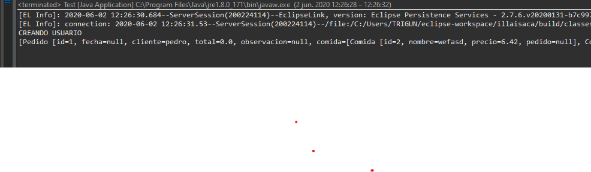
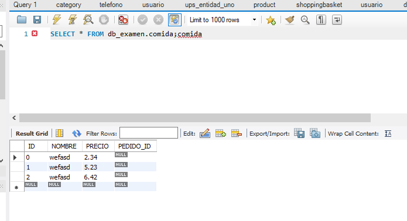
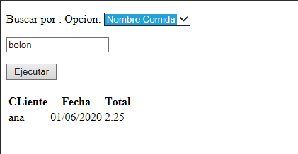
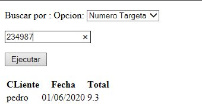
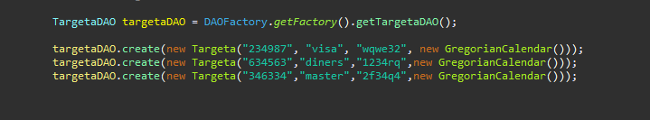
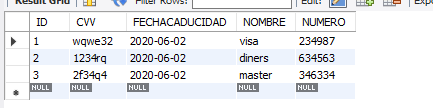

# CorreccionExamen
## Jps_ingreso_de_pedidos

## Ingreso_de_pedidos_en_la_base_de_datos

## Ingreso_de_comidas_en_la_base_de_datos

## Jsp_Listar_pedidos_por_nombre_de_comida

## Jsp_Listar_pedido_por_numero_de_targeta

## Precarga_de_targetas_de_credito

## Registro_de_targetas_en_la_base_de_datos

